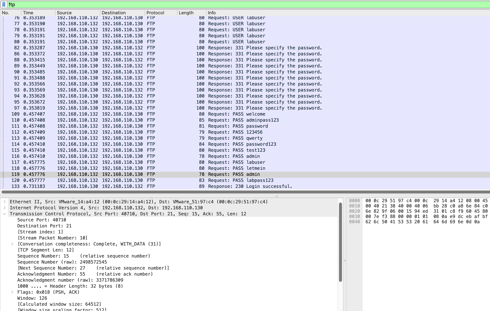

# FTP Brute Force

## Objective
Demonstrate that FTP transmits every authentication attempt — including every tested password — in cleartext, making the entire brute force attack visible to any network observer without any decryption.

---

## Lab Setup
| Property | Value |
|----------|-------|
| Attacker | Kali Linux — 192.168.110.132 |
| Target | Ubuntu 22.04 — 192.168.110.130 (vsftpd 3.0.5, port 21) |
| Capture interface | Ubuntu ens37 (defender perspective) |
| Capture file | `ch2b-ftp-bruteforce.pcapng` |

---

## Command Used

```bash
hydra -l labuser -P ~/lab_wordlist.txt ftp://192.168.110.130 -V
```

---

## Wireshark Filter

```
ftp
```

---

## Traffic Analysis

### Every credential attempt is readable

FTP provides zero encryption. Every packet in the authentication sequence appears in the Wireshark packet list as readable text:

```
Response: 220 (vsFTPd 3.0.5)     ← server banner — version exposed
Request:  USER labuser            ← username in plaintext
Response: 331 Please specify the password.
Request:  PASS admin              ← attempt 1 — visible
Request:  PASS password           ← attempt 2 — visible
Request:  PASS 123456             ← attempt 3 — visible
Request:  PASS welcome            ← attempt 4 — visible
Request:  PASS letmein            ← attempt 5 — visible
Request:  PASS qwerty             ← attempt 6 — visible
Request:  PASS labpass123         ← attempt 7 — visible
Request:  PASS labuser            ← attempt 8 — CORRECT PASSWORD
Response: 230 Login successful.
Request:  PASS test123            ← attempt 9 (parallel thread, sent after success)
Request:  PASS password123        ← attempt 10 — visible
Request:  PASS admin123           ← attempt 11 — visible
Request:  PASS adminpass123       ← attempt 12 — visible
Response: 530 Login incorrect.    ← all other attempts failed
```

### Wordlist reconstructible from capture

An observer recording this traffic can recover the complete tested wordlist, the successful credential (`labuser/labuser`), and the exact service version — all from passive observation.

### Weak credential finding

The correct credential was `labuser/labuser` — password equals username. It appeared as the 9th attempt in a 12-entry wordlist. Predictable credential patterns dramatically reduce brute force time.

---

## Attacker Perspective
Hydra completed the attack in under 5 seconds. FTP provided no resistance — every attempt was accepted, processed, and responded to with clear success/failure in plaintext.

## Defender Perspective
From Ubuntu's interface: 12 FTP connections each transmitting USER and PASS commands in plaintext, followed by 530 for failures and 230 for success. The complete attack — tool, username, every password tested, and the successful credential — is documented in the capture with no analysis required.

---

## Screenshot

**FTP brute force: all password attempts visible in the packet list. Response 230 Login successful visible at the bottom.**



---

## Key Findings

- All credentials visible in plaintext — no decryption, no tooling, no analysis required
- Server version exposed — `vsftpd 3.0.5` in the 220 banner
- Complete wordlist recoverable — all 12 tested passwords visible as sequential PASS packets
- Successful credential captured — `labuser/labuser` (password = username)
- 192 total packets — small capture, complete authentication story

---

## MITRE ATT&CK

| ID | Technique |
|----|-----------|
| T1110.001 | Brute Force: Password Guessing |
| T1040 | Network Sniffing |

---

## Defensive Recommendations

- Disable FTP entirely — no scenario justifies FTP over SFTP on a modern system
- Replace with SFTP — OpenSSH already runs on this host (port 22); configure `Subsystem sftp /usr/lib/openssh/sftp-server`
- Password policy: enforce that password cannot equal username
- If FTP must run: configure FTPS (`ssl_enable=YES` in vsftpd.conf) as a minimum
