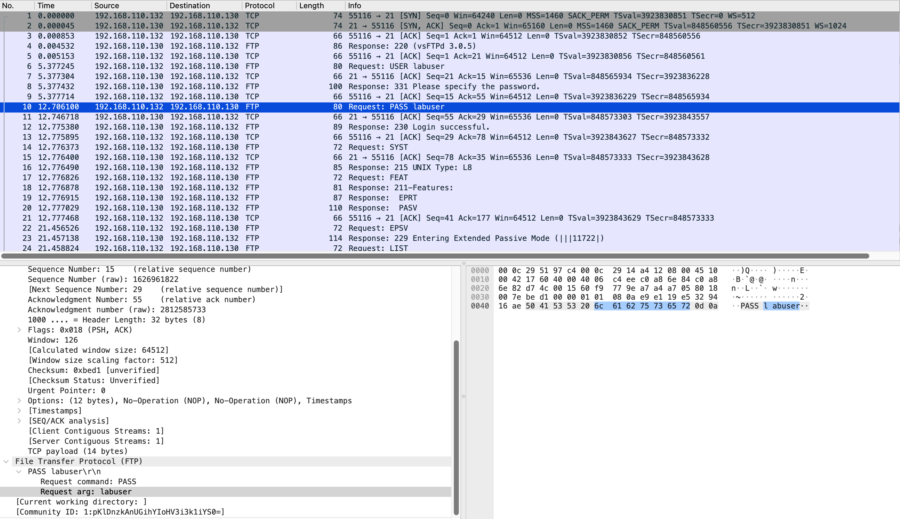

# FTP Session Credential Exposure

## Overview

A single authenticated FTP session was established to document the full extent of information exposed during normal FTP usage — beyond just credentials. While the brute-force scenario demonstrates credential exposure at volume, this scenario captures a clean individual session to show what any observer on the network path sees when a user authenticates over FTP: credentials, system information, directory paths, and the complete command exchange.

**Capture file:** [`ftp-session-credential-exposure.pcapng`](../pcap-files/authentication-attacks/ftp-session-credential-exposure.pcapng)

---

## Environment

| Property | Value |
|----------|-------|
| Source | 192.168.110.132 (Kali Linux) |
| Target | 192.168.110.130 (Ubuntu — vsftpd 3.0.5, port 21) |
| Interface captured | Ubuntu ens37 (defender perspective) |
| Capture perspective | Inbound traffic at target |

---

## Commands Used

```bash
# Manual FTP login — interactive session
ftp 192.168.110.130
# At prompt → Username: labuser
# At prompt → Password: labuser
```

---

## Wireshark Filter

```
ftp
```

---

## Analysis

### Complete Session Captured — 39 Packets

The entire session from TCP connection through logout is contained in 39 packets. Every exchange is in plaintext:

```
220 (vsFTPd 3.0.5)                          ← server banner
USER labuser                                 ← username
331 Please specify the password.
PASS labuser                                 ← password in cleartext
230 Login successful.
SYST → 215 UNIX Type: L8                    ← OS type returned
FEAT → 211-Features: EPRT, PASV             ← supported features
EPSV → 229 Entering Extended Passive Mode   ← data channel negotiated
LIST → 150/226                              ← directory listing transferred
PWD  → 257 "/home/labuser" is the current directory  ← full path disclosed
QUIT → 221 Goodbye.
```

The password `labuser` appears at packet 10 — readable directly in the Wireshark Info column without expanding any packet details.

### Scope of Exposure

A passive observer capturing this session recovers the following from a single user's normal activity:

| Category | Exposed Information |
|----------|-------------------|
| Authentication | Username: `labuser` / Password: `labuser` |
| Software | vsftpd 3.0.5 |
| OS type | UNIX Type: L8 (Linux) |
| Home directory | `/home/labuser` |
| Supported protocols | EPRT, PASV (passive mode) |
| Session activity | Directory listing contents, current path |

No attack tooling is required. Passive monitoring of port 21 traffic captures this in its entirety.

### Password Equals Username

The credential in use — `labuser:labuser` — uses a password identical to the account username. This is one of the most commonly compromised credential patterns due to its predictability. It suggests either that the default credential was never modified after account creation, or that no password complexity policy is enforced.

---

## Evidence

**Figure 1 — FTP session: PASS labuser visible in packet list and expanded in packet details. Full session flow from SYN through QUIT visible.**

*Row 10 highlighted: `Request: PASS labuser`. Middle pane confirms `Request arg: labuser`. Hex pane shows raw bytes spelling the password.*



---

## Key Findings

- **Password visible in packet list Info column** — no packet expansion or filtering required
- **Full session context exposed** — OS type, directory path, supported features, and session commands all transmitted in cleartext
- **39 packets captures a complete authentication and browse session**
- **Password equals username** — predictable credential pattern; compromised in the first attempt of any basic wordlist
- **Passive observation only** — no active attack required; any device on the network path with a packet capture capability recovers this data automatically

---

## MITRE ATT&CK

| ID | Technique | Tactic |
|----|-----------|--------|
| T1040 | Network Sniffing | Credential Access |

---

## Detection Recommendations

- **Eliminate FTP** — this scenario requires zero attack capability; passive network monitoring on port 21 captures credentials automatically from any legitimate user session
- **Audit active accounts** — identify all accounts where the password hash matches the username; enforce a change on first login or via policy
- **Migrate to SFTP** — the OpenSSH SFTP subsystem provides identical file transfer functionality with full session encryption: `Subsystem sftp /usr/lib/openssh/sftp-server`
- **Access logging** — regardless of protocol, log all authentication events including source IP, username, and timestamp for post-incident correlation
