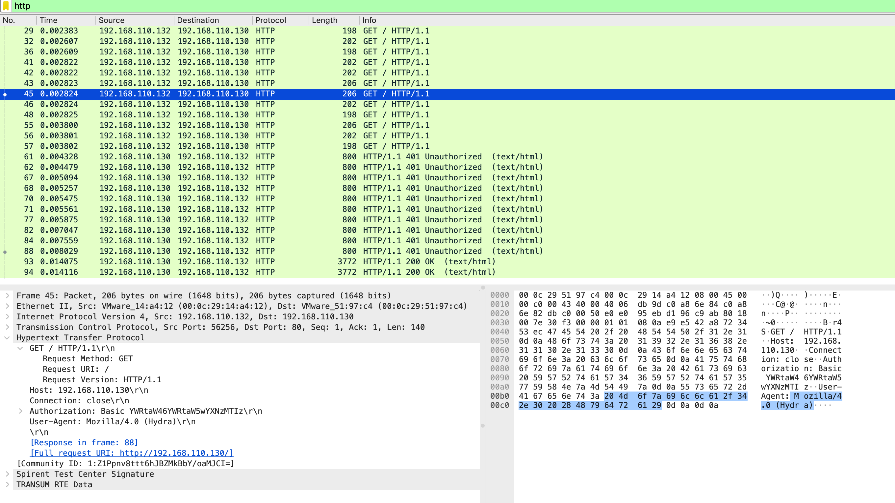
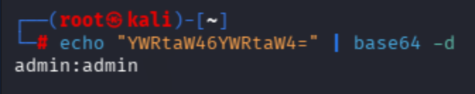

# HTTP Basic Authentication Attack

## Objective
Demonstrate that HTTP Basic Authentication uses Base64 encoding — not encryption — making credentials recoverable from any captured HTTP traffic with a single decode operation.

---

## Lab Setup
| Property | Value |
|----------|-------|
| Attacker | Kali Linux — 192.168.110.132 |
| Target | Ubuntu 22.04 — 192.168.110.130 (Apache 2.4.66, port 80) |
| Capture interface | Ubuntu ens37 (defender perspective) |
| Capture file | `ch2d-http-bruteforce.pcapng` |

---

## Command Used

```bash
hydra -l admin -P ~/lab_wordlist.txt http-get://192.168.110.130 -V
```

---

## Wireshark Filter

```
http
```

---

## Traffic Analysis

### Base64 is encoding, not encryption

Every HTTP GET request contains an `Authorization` header:

```
Authorization: Basic YWRtaW46YWRtaW4=
```

Decoding requires one command:

```bash
echo "YWRtaW46YWRtaW4=" | base64 -d
# Output: admin:admin
```

All 12 authorization attempts decoded:

| Base64 | Decoded | Response |
|--------|---------|----------|
| YWRtaW46YWRtaW4= | admin:admin | **200 OK** |
| YWRtaW46cGFzc3dvcmQ= | admin:password | 401 |
| YWRtaW46MTIzNDU2 | admin:123456 | 401 |
| YWRtaW46d2VsY29tZQ== | admin:welcome | 401 |
| YWRtaW46bGV0bWVpbg== | admin:letmein | 401 |
| YWRtaW46cGFzc3dvcmQxMjM= | admin:password123 | 401 |
| YWRtaW46YWRtaW5wYXNzMTIz | admin:adminpass123 | 401 |
| YWRtaW46dGVzdDEyMw== | admin:test123 | 401 |
| YWRtaW46cXdlcnR5 | admin:qwerty | 401 |
| YWRtaW46bGFicGFzczEyMw== | admin:labpass123 | 401 |
| YWRtaW46bGFidXNlcg== | admin:labuser | 401 |

Successful credential: `admin:admin` — password equals username, cracked on the first attempt.

### Hydra tool fingerprint in HTTP headers

```
User-Agent: Mozilla/4.0 (Hydra)
```

Hydra explicitly identifies itself in every request. A WAF monitoring HTTP headers detects and blocks Hydra by this string alone — independent of any rate-limiting rule.

### Response code pattern

```
HTTP/1.1 401 Unauthorized  ← failed attempts
HTTP/1.1 401 Unauthorized
...
HTTP/1.1 200 OK            ← credential found
```

Multiple 401 responses from the same destination followed by 200 OK from one source IP is the HTTP brute force signature. Wireshark automatically decoded `Credentials: admin:admin` in the packet details — no manual decoding required.

---

## Attacker Perspective
Hydra identified `admin:admin` on the first attempt. All authorization values were automatically decoded by Wireshark. The Base64 encoding provided zero protection.

## Defender Perspective
12 HTTP GET requests to `/` from 192.168.110.132 within milliseconds, each with a different Authorization header, all returning 401 except the final 200. `User-Agent: Mozilla/4.0 (Hydra)` identifies the tool precisely. The complete credential is recoverable without specialised tools — Wireshark decodes it automatically in the details panel.

---

## Screenshots

**HTTP brute force: Authorization header decoded to admin:admin by Wireshark. Hydra User-Agent visible.**



**Terminal: Base64 decode proving encoding is not encryption**



---

## Key Findings

- Credentials decoded in one command — Base64 provides zero security
- All 11 tested credentials recoverable from the capture
- Hydra fingerprinted by `User-Agent: Mozilla/4.0 (Hydra)` in every request
- Successful credential `admin:admin` — password equals username, first attempt
- Wireshark auto-decodes — `Credentials: admin:admin` shown without manual work

---

## MITRE ATT&CK

| ID | Technique |
|----|-----------|
| T1110.001 | Brute Force: Password Guessing |
| T1040 | Network Sniffing |

---

## Defensive Recommendations

- Deploy HTTPS — TLS encrypts all HTTP content including auth headers
- Replace Basic Auth with session-based or token-based authentication
- Rate limit 401 responses: implement `mod_evasive` or Fail2ban for Apache
- WAF rule: block requests with `User-Agent: *Hydra*`
- Strong credentials: `admin/admin` is the most commonly attempted pair in any brute force campaign
