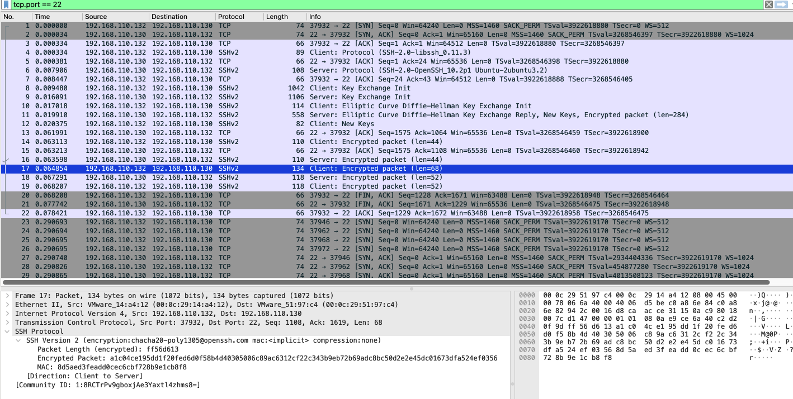

# SSH Brute Force

## Objective
Demonstrate that SSH brute force attacks are detectable through connection pattern analysis even though SSH encryption prevents any credential visibility.

---

## Lab Setup
| Property | Value |
|----------|-------|
| Attacker | Kali Linux — 192.168.110.132 |
| Target | Ubuntu 22.04 — 192.168.110.130 (SSH port 22) |
| Capture interface | Ubuntu ens37 (defender perspective) |
| Capture file | `ch2a-ssh-bruteforce.pcapng` |

---

## Command Used

```bash
hydra -l labuser -P ~/lab_wordlist.txt ssh://192.168.110.130 -t 4 -V
```

---

## Wireshark Filter

```
tcp.port == 22
```

---

## Traffic Analysis

### Connection pattern — the brute force signature

Five TCP conversations to port 22 from the same source IP within milliseconds of each other:

```
192.168.110.132:37932 ↔ 192.168.110.130:22   22 packets   0.078s
192.168.110.132:37946 ↔ 192.168.110.130:22   27 packets   6.242s
192.168.110.132:37962 ↔ 192.168.110.130:22   27 packets   6.251s
192.168.110.132:37968 ↔ 192.168.110.130:22   27 packets   4.718s
192.168.110.132:37972 ↔ 192.168.110.130:22   28 packets   3.585s
```

Five separate SSH connections from the same IP in rapid succession. No legitimate user opens and closes SSH connections five times in a few seconds.

### Each connection lifecycle

```
[SYN] → [SYN-ACK] → [ACK]                    ← three-way handshake
Client: Protocol (SSH-2.0-libssh_0.11.3)      ← Hydra fingerprint
Server: Protocol (SSH-2.0-OpenSSH_10.2p1)     ← server banner
[Key Exchange Init]                            ← encryption negotiation begins
[ECDH Key Exchange Reply, New Keys]            ← session is now encrypted
[Encrypted packets]                            ← auth attempt — not visible
[FIN-ACK] → [FIN-ACK]                         ← connection closed
```

After `New Keys`, all traffic is encrypted. The authentication result is not visible.

### Hydra tool fingerprint

```
SSH-2.0-libssh_0.11.3
```

Hydra uses the `libssh` library, not OpenSSH. A real user connecting via `ssh` would show `SSH-2.0-OpenSSH_x.x`. The `libssh` string in an SSH Client Protocol packet is a fingerprint for automated SSH tooling.

### Encryption confirmed

Middle pane for any post-handshake packet:
```
SSH Version 2 (encryption: chacha20-poly1305@openssh.com)
Encrypted Packet: [hex blob — no readable content]
MAC: [hex blob]
```

Zero readable content. Credentials, commands, and responses are cryptographically opaque.

---

## Attacker Perspective
Hydra attempted each wordlist entry as a separate SSH connection. Tool found `labuser/labuser` after working through the list. SSH provided no information about individual authentication failures.

## Defender Perspective
Five complete SSH handshakes from 192.168.110.132 within seconds. `SSH-2.0-libssh_0.11.3` in each connection identifies the tool as Hydra. Even without seeing credentials: same source IP + multiple rapid SSH connections + `libssh` banner = high-confidence brute force alert. A threshold rule of 3+ SSH connections from one source within 10 seconds catches this.

---

## Screenshot

**SSH brute force: repeated connections in packet list. Middle pane shows chacha20-poly1305 encryption — zero credential visibility.**



---

## Key Findings

- Credentials are NOT visible — SSH encryption is effective at the packet level
- Attack IS detectable — 5 rapid connections from one source is the behavioural fingerprint
- Hydra identified by `SSH-2.0-libssh_0.11.3` — not the OpenSSH client string a human uses
- Encryption algorithm: chacha20-poly1305 — modern, secure cipher
- Detection method: connection rate analysis, not content inspection

---

## MITRE ATT&CK

| ID | Technique |
|----|-----------|
| T1110.001 | Brute Force: Password Guessing |

---

## Defensive Recommendations

- Fail2ban: block IPs after 3–5 failed SSH authentication attempts within 60 seconds
- SSH key authentication: set `PasswordAuthentication no` in `/etc/ssh/sshd_config` — eliminates brute force viability entirely
- IDS rule: alert on `libssh` in SSH Client Protocol banner — automated tooling, not a human user
- SIEM correlation: rapid SSH connections from one IP + `libssh` banner = high-confidence Hydra brute force alert
