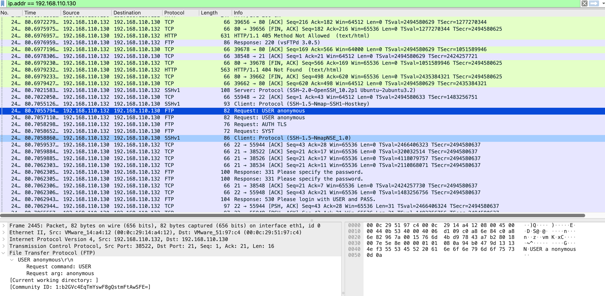

# Aggressive Scan (OS Detection + NSE Scripts)

## Objective
Demonstrate how Nmap's aggressive scan combines OS fingerprinting, version detection, and NSE scripting into one comprehensive pass — and how its multi-protocol activity creates an unmistakable signature in packet captures.

---

## Lab Setup
| Property | Value |
|----------|-------|
| Attacker | Kali Linux — 192.168.110.132 |
| Target | Ubuntu 22.04 — 192.168.110.130 |
| Capture interface | Kali ens37 (attacker perspective) |
| Capture file | `nmap-agressive-scan.pcapng` |

---

## Command Used

```bash
sudo nmap -A 192.168.110.130
```

`-A` enables OS detection, version detection, NSE script scanning, and traceroute simultaneously.

---

## Nmap Output

```
PORT   STATE SERVICE VERSION
21/tcp open  ftp     vsftpd 3.0.5
22/tcp open  ssh     OpenSSH 10.2p1 Ubuntu 2ubuntu3.2
80/tcp open  http    Apache httpd 2.4.66 ((Ubuntu))
|_http-title: Apache2 Ubuntu Default Page: It works
|_http-server-header: Apache/2.4.66 (Ubuntu)

No exact OS matches — TCP/IP fingerprint generated
Network Distance: 1 hop
Duration: 25.68 seconds
```

---

## Wireshark Filter

```
ip.addr == 192.168.110.130
```

---

## Traffic Analysis

### Multi-protocol activity — the aggressive scan signature

| Protocol | Packets | Purpose |
|----------|---------|---------|
| TCP | 2653 | Port scan + full connections |
| FTP | 55 | FTP service probing |
| HTTP | 55 | Web service enumeration |
| SSH | 31 | SSH service probing |
| ICMP | 20 | Traceroute + OS probes |
| DNS | 49 | Background resolution |

No legitimate application generates mixed FTP, HTTP, SSH, and ICMP traffic simultaneously from the same source.

### HTTP NSE probes

Nmap's default HTTP scripts sent the following requests automatically:

```
GET  /
GET  /.git/HEAD         ← checks for exposed source code repository
GET  /HNAP1             ← home network admin protocol probe
GET  /evox/about        ← TP-Link/router admin panel check
GET  /favicon.ico
GET  /robots.txt
POST /sdk               ← VMware SDK probe
OPTIONS /
PROPFIND /              ← WebDAV filesystem access check
```

The `/.git/HEAD` probe is significant — Nmap automatically checks whether Git repositories are accidentally accessible on web servers, a common misconfiguration that exposes source code, credentials, and internal paths.

### FTP default credential probe

```
Request: USER anonymous
Request: AUTH TLS
Request: SYST
Response: 331 Please specify the password
Response: 530 Please login with USER and PASS
```

Nmap probes FTP with anonymous credentials automatically. Aggressive scans are not purely passive — they actively test service configurations.

### Nmap NSE fingerprint in SSH traffic

```
Client: Protocol (SSH-1.5-NmapNSE_1.0)
```

Nmap's SSH NSE module explicitly identifies itself in the protocol banner. This string is a definitive IOC for Nmap aggressive scanning — irrefutable and requiring no interpretation.

### OS detection — no exact match

A TCP/IP fingerprint was generated but no exact OS match was found. This is expected for modern Linux kernels with randomised IP IDs and TCP timestamps. OS detection failure is itself a defensive data point worth noting.

---

## Attacker Perspective
Complete service enumeration, default credential testing, web path probing, OS fingerprinting, and traceroute in one command. The `.git/HEAD` and WebDAV checks demonstrate that aggressive scans test for misconfigurations, not just open ports.

## Defender Perspective
An explosion of mixed-protocol traffic — FTP probes, HTTP requests to unusual paths, SSH connections, ICMP traceroute — all from the same source IP within 25 seconds. The `SSH-1.5-NmapNSE_1.0` banner is a definitive Nmap fingerprint requiring no analysis tools to interpret.

---

## Screenshot

**Aggressive scan: multi-protocol packet list with FTP USER anonymous probe expanded in middle pane**



---

## Key Findings

- `SSH-1.5-NmapNSE_1.0` banner — definitive Nmap tool fingerprint in SSH traffic
- `GET /.git/HEAD` — automatic check for exposed Git repositories
- `USER anonymous` FTP probe — default credential testing built into NSE scripts
- `PROPFIND /` — WebDAV access check (potential file upload path)
- 2896 total packets in 25 seconds — highest-volume scan; unmistakable in any IDS
- OS fingerprint generated but no exact match — modern Ubuntu kernel resists fingerprinting

---

## MITRE ATT&CK

| ID | Technique |
|----|-----------|
| T1595 | Active Scanning |
| T1082 | System Information Discovery |
| T1046 | Network Service Scanning |

---

## Defensive Recommendations

- IDS signature: alert on `SSH-1.5-NmapNSE_1.0` in SSH client protocol banners
- WAF rule: block requests to `/.git/HEAD`, `/HNAP1`, `/evox/about`, `/sdk` — no legitimate user requests these paths
- Disable WebDAV: `a2dismod dav` in Apache unless explicitly required
- Protect `.git` in Apache: `<Directory "*.git"> Deny from all </Directory>`
- Rate limiting: any source generating >100 mixed-protocol requests in 30 seconds triggers an automated block
