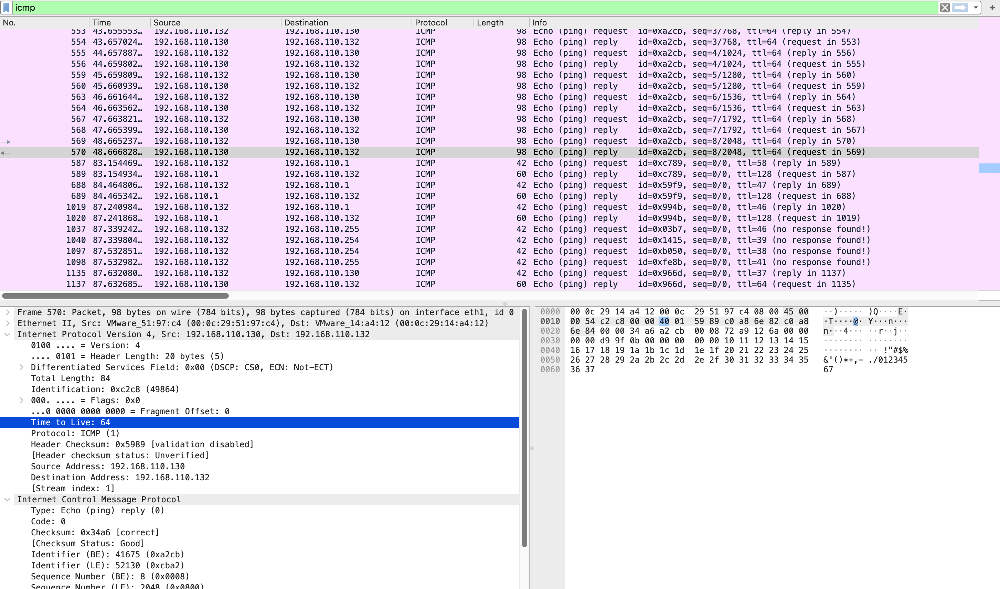

# Host Discovery Analysis

## Overview

Host discovery was performed against the 192.168.110.0/24 subnet to identify live hosts prior to service enumeration. Two techniques were applied: ARP-based discovery for layer-2 host identification and ICMP Echo (ping) for confirming IP-level connectivity. Analysis of ICMP reply packets revealed OS-level information through TTL value inspection without requiring a dedicated OS detection scan.

**Capture file:** [`host-discovery-sweep.pcapng`](../pcap-files/network-reconnaissance/host-discovery-sweep.pcapng)

---

## Environment

| Property | Value |
|----------|-------|
| Source | 192.168.110.132 (Kali Linux) |
| Target subnet | 192.168.110.0/24 |
| Interface captured | ens37 (Host-only network) |
| Capture perspective | Attacker interface |

---

## Commands Used

```bash
# ARP-based subnet sweep — identifies live hosts at layer 2
sudo nmap -sn 192.168.110.0/24

# Direct ICMP ping to confirm target connectivity
ping 192.168.110.130 -c 8

# ICMP-only sweep — bypasses ARP, forces IP-level ICMP Echo
sudo nmap -sn -PE --send-ip 192.168.110.0/24
```

Full terminal output: [`nmap-recon-terminal-output.txt`](nmap-recon-terminal-output.txt)

---

## Wireshark Filter

```
icmp
```

---

## Analysis

### Hosts Identified

The subnet sweep returned four live hosts within 12.43 seconds:

| IP Address | MAC Address | Identity |
|-----------|------------|---------|
| 192.168.110.1 | 00:50:56:C0:00:01 | VMware gateway |
| 192.168.110.130 | 00:0C:29:51:97:C4 | Ubuntu target host |
| 192.168.110.254 | 00:50:56:E5:C4:DE | VMware DHCP service |
| 192.168.110.132 | — | Source machine (Kali) |

### ARP vs ICMP Discovery Behaviour

On locally connected subnets, Nmap initiates host discovery using ARP before sending ICMP probes. ARP responses are more reliable at layer 2 — hosts respond to ARP even when ICMP is filtered at the firewall. This is visible in the capture as ARP request/response pairs preceding the ICMP Echo traffic.

Running the same sweep with `--send-ip` (forces IP-level ICMP, suppresses ARP) returned only three hosts — 192.168.110.254 (VMware DHCP service) did not respond to ICMP but was visible via ARP. This difference in results across techniques is relevant when assessing whether firewall rules may be suppressing ICMP on specific hosts.

### OS Fingerprinting via TTL

ICMP Echo Reply packets contain a TTL value set by the responding host's operating system. With no intermediate routing hops on a directly connected /24 segment, the observed TTL equals the starting value:

| Responding Host | TTL Observed | OS Inference |
|----------------|-------------|-------------|
| 192.168.110.130 (Ubuntu) | **64** | Linux — default TTL is 64 |
| 192.168.110.1 (gateway) | **128** | Windows — default TTL is 128 |

OS type was confirmed for two hosts without executing any dedicated OS fingerprinting scan. This technique is reliable on local segments with no hops, though TTL values can be modified through OS configuration or normalised at the firewall.

### Ping Statistics

Direct ping to the target confirmed stable connectivity:

```
8 packets transmitted, 8 received, 0% packet loss
rtt min/avg/max/mdev = 0.980/1.529/1.977/0.334 ms
```

No packet loss and consistent sub-2ms response times confirm the target is reachable and responsive.

---

## Evidence

**Figure 1 — ICMP sweep with Ubuntu TTL=64 confirming Linux OS fingerprint**



**Figure 2 — Gateway reply with TTL=128 confirming Windows OS fingerprint**


---

## Key Findings

- **4 live hosts** identified on the 192.168.110.0/24 subnet in 12.43 seconds
- **OS fingerprinting via TTL:** Ubuntu host confirmed Linux (TTL 64); gateway confirmed Windows (TTL 128)
- **ARP discovery finds more hosts** than ICMP-only on local segments — 192.168.110.254 responded to ARP but not ICMP
- **Absence of ICMP reply** is itself a data point — hosts that appear live via ARP but silent on ICMP may have ICMP filtered at the host or network level

---

## MITRE ATT&CK

| ID | Technique | Tactic |
|----|-----------|--------|
| T1018 | Remote System Discovery | Discovery |
| T1595.001 | Active Scanning: Scanning IP Blocks | Reconnaissance |

---

## Detection Recommendations

- Alert on ICMP Echo Request volume exceeding 10 packets from a single source within 10 seconds
- On internal segments, ARP table monitoring provides earlier visibility than ICMP-based detection — a host scanning the subnet via ARP generates requests to every address sequentially
- ICMP blocking alone is insufficient to prevent host discovery on local segments; ARP cannot be filtered at layer 3
