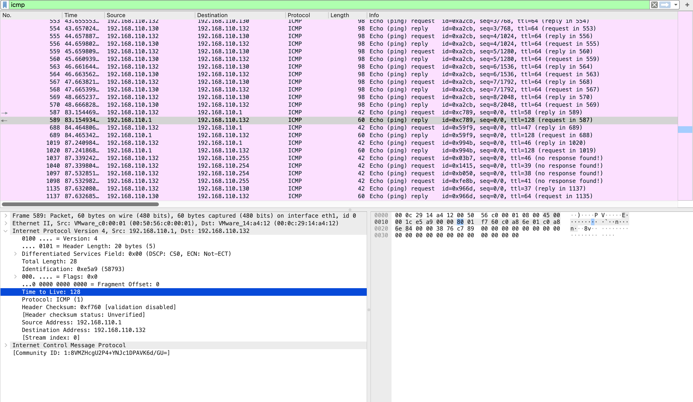

# ICMP Ping Sweep

## Objective
Demonstrate host discovery via ICMP Echo and ARP, and how TTL values in ICMP replies expose the operating system of each responding host without any dedicated OS scan.

---

## Lab Setup
| Property | Value |
|----------|-------|
| Attacker | Kali Linux — 192.168.110.132 |
| Target subnet | 192.168.110.0/24 |
| Capture interface | Kali ens37 (attacker perspective) |
| Capture file | `icmp-ping-sweep.pcapng` |

---

## Commands Used

```bash
sudo nmap -sn 192.168.110.0/24
ping 192.168.110.130 -c 8
sudo nmap -sn -PE --send-ip 192.168.110.0/24
```

---

## Nmap Output

```
Nmap scan report for 192.168.110.1      → VMware gateway     (up)
Nmap scan report for 192.168.110.130    → Ubuntu target      (up)
Nmap scan report for 192.168.110.254    → VMware DHCP        (up)
Nmap scan report for 192.168.110.132    → Kali (self)        (up)
4 hosts up — 256 addresses scanned in 12.43 seconds
```
*Full terminal output: [`nmap-terminal-output.txt`](nmap-terminal-output.txt)*
---

## Wireshark Filter

```
icmp
```

---

## Traffic Analysis

### ARP before ICMP

On a local subnet, Nmap sends ARP requests before ICMP probes. ARP is more reliable at layer 2 — devices respond to ARP even when ICMP is firewalled.

```
VMware_14:a4:12 → Broadcast    ARP  Who has 192.168.110.x? Tell 192.168.110.132
VMware_51:97:c4 → VMware_14:a4:12   ARP  192.168.110.130 is at 00:0c:29:51:97:c4
```

### ICMP Echo Request / Reply pairs

```
192.168.110.132 → 192.168.110.130   ICMP  Echo (ping) request  ttl=64
192.168.110.130 → 192.168.110.132   ICMP  Echo (ping) reply    ttl=64
```

### OS fingerprinting via TTL

| Host | TTL in reply | OS indicated |
|------|-------------|--------------|
| 192.168.110.130 (Ubuntu) | **64** | Linux / Unix |
| 192.168.110.1 (gateway) | **128** | Windows |

Linux hosts start with TTL 64. Windows hosts start with TTL 128. On a directly connected /24 with no hops, the observed TTL equals the starting value.

### ARP vs ICMP discovery

The `--send-ip` flag forces ICMP-only (bypasses ARP). The second scan found only 3 hosts — 192.168.110.254 (VMware DHCP service) responded to ARP but not ICMP. Discovery technique affects results: ARP finds more hosts on local segments.

### Non-responding hosts

`192.168.110.254` and `.255` produced `(no response found!)` in ICMP output. Absence of reply is itself reconnaissance data.

---

## Attacker Perspective
Four live hosts discovered in 12.43 seconds. OS type identified for two hosts from TTL values alone — no additional scanning required. Ubuntu target confirmed alive and Linux-based.

## Defender Perspective
From Ubuntu's monitoring interface: ICMP Echo Requests arriving from 192.168.110.132 at regular intervals with incrementing sequence numbers. In a real environment, a burst from a single source across a subnet range is a ping sweep — triggerable on volume threshold (>10 ICMP Echo Requests from one source within 5 seconds).

---

## Screenshot

**Full ICMP sweep — Ubuntu TTL=64 (Linux) and gateway TTL=128 (Windows) visible**




---

## Key Findings

- 4 live hosts discovered across the /24 subnet
- OS fingerprinting from TTL values alone: Ubuntu=Linux (TTL 64), Gateway=Windows (TTL 128)
- ARP-based discovery finds more hosts on local segments than ICMP-only
- Non-responding hosts (.254 on ICMP-only scan) are still useful reconnaissance data points

---

## MITRE ATT&CK

| ID | Technique |
|----|-----------|
| T1018 | Remote System Discovery |
| T1595.001 | Active Scanning: Scanning IP Blocks |

---

## Defensive Recommendations

- IDS threshold rule: alert on >10 ICMP Echo Requests from a single source within 10 seconds
- Firewall: block ICMP Echo Requests from untrusted external sources at the perimeter
- Internal networks: threshold-based detection is preferable to blocking ICMP entirely — suppressing ICMP impedes legitimate troubleshooting
