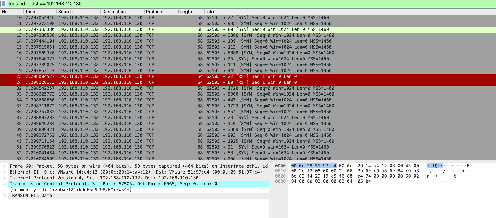
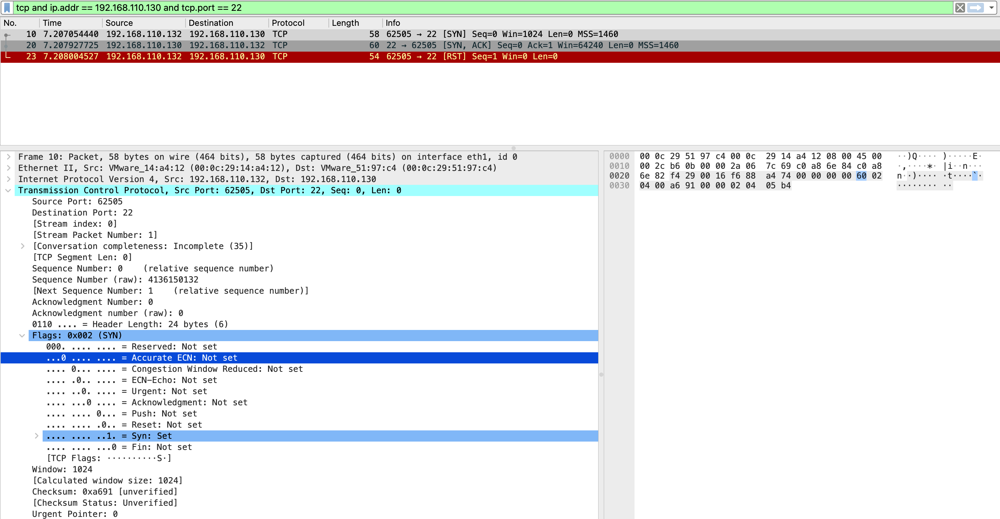

# TCP SYN Scan (Half-Open Scan)

## Objective
Demonstrate how a TCP SYN scan enumerates open ports using half-open connections, and how Nmap's distinctive probe signature makes the scan fingerprint detectable on the wire.

---

## Lab Setup
| Property | Value |
|----------|-------|
| Attacker | Kali Linux — 192.168.110.132 |
| Target | Ubuntu 22.04 — 192.168.110.130 |
| Capture interface | Kali ens37 (attacker perspective) |
| Capture file | `nmap-syn-scan.pcapng` |

---

## Command Used

```bash
sudo nmap -sS 192.168.110.130
```

`-sS` requires root because crafting raw TCP packets requires elevated privileges.

---

## Nmap Output

```
PORT   STATE  SERVICE
21/tcp open   ftp
22/tcp open   ssh
80/tcp open   http

997 closed tcp ports (reset)
Scan completed in 4.78 seconds
```

*Full terminal output: [`nmap-terminal-output.txt`](nmap-terminal-output.txt)*

---

## Wireshark Filters

**All traffic to target:**
```
tcp and ip.dst == 192.168.110.130
```

**Isolate the half-open sequence on an open port:**
```
tcp and ip.addr == 192.168.110.130 and tcp.port == 22
```

---

## Traffic Analysis

### Half-open mechanism

A SYN scan deliberately never completes the TCP three-way handshake.

**Open port (port 22):**
```
Kali → Ubuntu:22   [SYN]      Seq=0 Win=1024  ← probe sent
Ubuntu → Kali      [SYN, ACK] Seq=0 Ack=1     ← port is open
Kali → Ubuntu:22   [RST]      Seq=1 Win=0     ← deliberately aborted
```

**Closed port:**
```
Kali → Ubuntu:995  [SYN]      Seq=0 Win=1024  ← probe sent
Ubuntu → Kali      [RST, ACK] Seq=1 Win=0     ← port is closed, no handshake
```

Connection is never completed. RST is sent instead of ACK after receiving SYN-ACK.

### Nmap probe signature — tool fingerprinting

Every SYN probe carries:
```
Win=1024   Len=0   MSS=1460
```

A real OS TCP stack uses `Win=64240` or larger. `Win=1024` is Nmap's crafted packet value — not a natural OS default. This value alone fingerprints Nmap specifically, regardless of scan type.

### Volume and speed

~200 SYN probes per second from a single source port (62505) to sequential destination ports. No legitimate application produces this pattern.

### Conversation completeness

Wireshark automatically flags each stream: `Conversation completeness: Incomplete (35)` — confirming the handshake was never finished.

---

## Attacker Perspective
Three open ports confirmed (21, 22, 80) from 1000 probed ports in 4.78 seconds.

## Defender Perspective
From Ubuntu's monitoring interface: hundreds of TCP SYN packets from 192.168.110.132 to sequential destination ports, each followed by RST rather than ACK. Win=1024 in every probe. All conversations flagged incomplete. The volume, speed, and Win=1024 pattern are all distinct IDS trigger points.

---

## Screenshot

**Rapid SYN flood overview and half-open sequence (SYN → SYN-ACK → RST) with TCP flags expanded**





---

## Key Findings

- 3 open ports confirmed: 21 (FTP), 22 (SSH), 80 (HTTP)
- `Win=1024` in every SYN probe — Nmap fingerprint, not a real OS window size
- RST sent immediately after SYN-ACK — half-open, no full connection established
- `Conversation completeness: Incomplete` — Wireshark flags abnormal termination automatically
- ~200 probes/second from one source — impossible to confuse with normal traffic

---

## MITRE ATT&CK

| ID | Technique |
|----|-----------|
| T1046 | Network Service Scanning |

---

## Defensive Recommendations

- IDS rule: alert on >50 TCP SYN packets from one source to different destination ports within 5 seconds
- IDS signature: TCP SYN with `Win=1024` and `MSS=1460` from external sources — Nmap default probe
- Firewall: reduce exposed service count — FTP (port 21) provides no security benefit over SFTP
