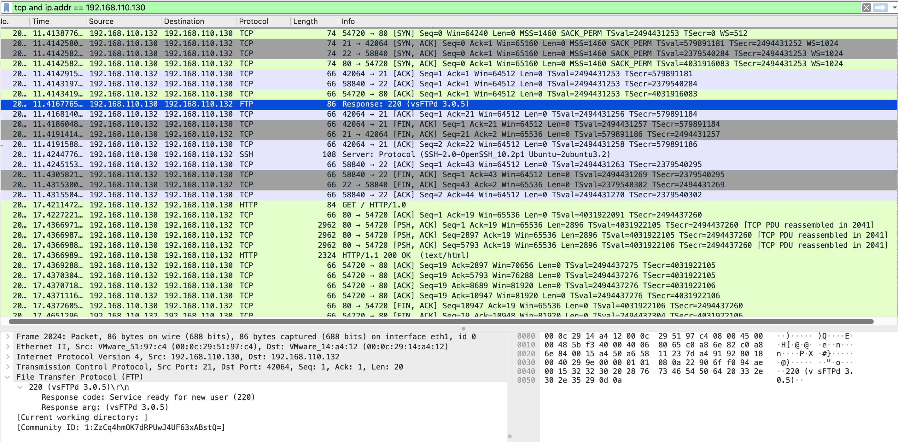

# Service Version Enumeration

## Overview

Service version detection was performed against the three open ports identified during the port scan. Unlike the SYN scan, version detection requires completing full TCP connections to retrieve service banners — the server-provided strings that identify the software and version running on each port. All three services returned version information, providing a complete picture of the target's software stack from a single scan.

**Capture file:** [`service-version-enumeration.pcapng`](../pcap-files/network-reconnaissance/service-version-enumeration.pcapng)

---

## Environment

| Property | Value |
|----------|-------|
| Source | 192.168.110.132 (Kali Linux) |
| Target | 192.168.110.130 (Ubuntu) |
| Interface captured | ens37 (Host-only network) |
| Capture perspective | Attacker interface |

---

## Commands Used

```bash
# Service and version detection
# Note: without sudo, falls back to TCP connect scan (full handshake)
nmap -sV 192.168.110.130
```

Full terminal output: [`nmap-recon-terminal-output.txt`](nmap-recon-terminal-output.txt)

---

## Wireshark Filter

```
tcp and ip.addr == 192.168.110.130
```

---

## Analysis

### Version Detection Results

```
PORT   STATE SERVICE VERSION
21/tcp open  ftp     vsftpd 3.0.5
22/tcp open  ssh     OpenSSH 10.2p1 Ubuntu 2ubuntu3.2 (Ubuntu Linux; protocol 2.0)
80/tcp open  http    Apache httpd 2.4.66 ((Ubuntu))
Service Info: OSs: Unix, Linux; CPE: cpe:/o:linux:linux_kernel
```

Exact software versions were retrieved for all three services in 10.95 seconds.

### Full Handshake vs SYN Scan — Traffic Difference

Version detection produces noticeably different traffic from the SYN scan. Where the SYN scan sends half-open probes and terminates with RST, version detection completes full TCP connections and exchanges application data:

```
# Version detection — full connection established
192.168.110.132 → 192.168.110.130:21  [SYN]
192.168.110.130 → 192.168.110.132     [SYN, ACK]
192.168.110.132 → 192.168.110.130:21  [ACK]           ← handshake completes
192.168.110.130 → 192.168.110.132     FTP: 220 (vsFTPd 3.0.5)  ← banner returned
192.168.110.132 → 192.168.110.130:21  [FIN, ACK]      ← graceful close
```

The presence of ACK packets completing the handshake, followed by application data and a graceful FIN close, distinguishes version detection traffic from SYN scan traffic in any packet capture.

### Banners Retrieved

**FTP (port 21):**
```
220 (vsFTPd 3.0.5)
```
Discloses the FTP daemon name and exact version number.

**SSH (port 22):**
```
SSH-2.0-OpenSSH_10.2p1 Ubuntu-2ubuntu3.2
```
Discloses SSH protocol version, OpenSSH release, Ubuntu package version, and OS distribution.

**HTTP (port 80):**
```
Server: Apache/2.4.66 (Ubuntu)
```
Discloses web server software, version, and OS distribution. The HTTP response body additionally confirmed a default Apache installation: `Apache2 Ubuntu Default Page: It works` — indicating no custom application is deployed.

### Security Implication of Version Disclosure

Each version string maps directly to searchable vulnerability databases (NVD, Exploit-DB, CVE databases). An attacker with this output can immediately query for known vulnerabilities affecting these specific releases:

| Service | Version Exposed | Information Disclosed |
|---------|----------------|----------------------|
| vsftpd | 3.0.5 | FTP daemon, exact release |
| OpenSSH | 10.2p1 | SSH release, Ubuntu package, OS distro |
| Apache | 2.4.66 | Web server release, OS distro |

The OS distribution (Ubuntu) and kernel type (Linux) were also inferred from the SSH banner and CPE data — OS-level intelligence without running a dedicated OS detection scan.

---

## Evidence

**Figure 1 — Version detection capture: full TCP connections and FTP banner expanded**

*Packet list shows SYN-ACK-data-FIN pattern. FTP banner `220 (vsFTPd 3.0.5)` expanded in packet details.*



---

## Key Findings

- **vsftpd 3.0.5** — FTP version exposed via 220 service banner
- **OpenSSH 10.2p1 Ubuntu-2ubuntu3.2** — SSH version, Ubuntu package revision, and OS distribution exposed
- **Apache httpd 2.4.66 (Ubuntu)** — web server version and OS distribution exposed
- **Default installation confirmed** — Apache default page served; no production application deployed
- **Full TCP connections created** — unlike the SYN scan, version detection generates complete session logs on the target
- **OS confirmed as Ubuntu Linux** — inferred from SSH banner and CPE metadata without running `-O`

---

## MITRE ATT&CK

| ID | Technique | Tactic |
|----|-----------|--------|
| T1046 | Network Service Scanning | Discovery |
| T1082 | System Information Discovery | Discovery |

---

## Detection Recommendations

- Suppress version banners to reduce information disclosure:
  - Apache: `ServerTokens Prod` and `ServerSignature Off` in `/etc/apache2/apache2.conf`
  - vsftpd: `ftpd_banner=FTP Server Ready` in `/etc/vsftpd.conf`
  - SSH: `DebianBanner no` in `/etc/ssh/sshd_config`
- Replace the Apache default page to avoid confirming infrastructure details
- Rapid sequential full connections from one source across multiple ports in seconds indicates automated version scanning — alert on this pattern in connection logs
