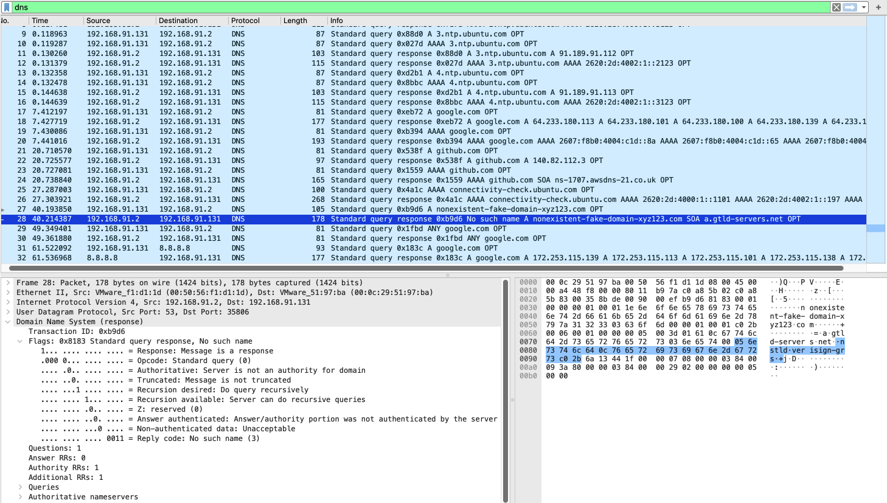

# DNS Traffic Analysis

## Objective
Demonstrate what normal DNS looks like on the wire, contrast it with NXDOMAIN responses, and explain why specific DNS patterns are high-confidence SOC indicators for malware C2 and DGA activity.

---

## Lab Setup
| Property | Value |
|----------|-------|
| Source | Ubuntu 22.04 — 192.168.91.131 (NAT interface with internet access) |
| DNS resolver | 192.168.91.2 (VMware NAT gateway) |
| External resolver | 8.8.8.8 (Google Public DNS) |
| Capture interface | Ubuntu ens33 (NAT interface — internet-facing) |
| Capture file | `ch3d-dns-analysis.pcapng` |

---

## Commands Used

```bash
nslookup google.com
nslookup github.com
nslookup nonexistent-fake-domain-xyz123.com
dig google.com ANY
dig @8.8.8.8 google.com
```

---

## Wireshark Filter

```
dns
```

---

## Traffic Analysis

### Normal A record resolution — google.com

```
Query:    Standard query A google.com
Response: A 64.233.180.113
          A 64.233.180.101
          A 64.233.180.100
          A 64.233.180.139
          A 64.233.180.102
          A 64.233.180.138
```

Six A records returned — Google uses multiple IPs for load balancing and redundancy. Each record carries a TTL value (cache duration). Normal DNS resolves a domain to IP addresses quickly and predictably.

### NXDOMAIN — nonexistent domain

```
Query:    Standard query A nonexistent-fake-domain-xyz123.com
Response: No such name (DNS response code 3)
          SOA a.gtld-servers.net
```

DNS response code 3 = NXDOMAIN (Non-Existent Domain). The queried domain does not exist.

**Why NXDOMAIN matters for SOC detection:**

Malware using Domain Generation Algorithms (DGA) generates pseudo-random domain names and queries them sequentially, looking for the one registered by the attacker as the C2 server. Each failed query produces NXDOMAIN. A host generating 50+ NXDOMAIN responses per minute is a high-confidence malware indicator. A single NXDOMAIN is normal — the volume and rate are the signal.

### Direct query to external resolver — 8.8.8.8

```
Source:      192.168.91.131
Destination: 8.8.8.8  ← external resolver, bypassing internal DNS
Query:       A google.com
Response:    A 172.253.115.139
```

DNS traffic sent directly to 8.8.8.8 bypasses the internal corporate resolver. This is a detection-evasion technique — malware may use external DNS to avoid enterprise DNS monitoring and filtering. In any corporate environment, internal hosts querying non-authorised resolvers should trigger an alert.

### Background NTP DNS traffic

The capture opens with Ubuntu's NTP service automatically resolving time servers:

```
Standard query A 1.ntp.ubuntu.com
Standard query A 2.ntp.ubuntu.com
...
```

This is normal background OS activity — not user-initiated, not suspicious. Baselining background DNS patterns is essential for reducing false positives.

### ANY query — RFC 8482 restriction

`dig google.com ANY` returned a minimal response. Modern DNS servers restrict ANY queries per RFC 8482 to prevent DNS amplification attacks. This is expected server-side behaviour.

---

## Screenshot

**DNS capture: NXDOMAIN response for fake domain visible. Query/response pair shown with google.com and github.com resolutions above.**



---

## Key Findings

- Normal DNS: fast A record resolution, multiple IPs for major domains (load balancing pattern)
- NXDOMAIN (response code 3): domain does not exist — high-volume NXDOMAIN from one host = DGA/C2 indicator
- Direct DNS to 8.8.8.8: bypasses internal monitoring — detection-evasion technique
- Background NTP queries: OS-generated, must be baselined to avoid false positives
- ANY query restriction: RFC 8482 — expected modern DNS behaviour, not an anomaly

---

## MITRE ATT&CK

| ID | Technique |
|----|-----------|
| T1071.004 | Application Layer Protocol: DNS |
| T1568 | Dynamic Resolution |

---

## Defensive Recommendations

- DNS logging: log all queries at the resolver; alert on >20 NXDOMAIN responses from one host within 60 seconds
- Block direct external DNS: firewall rule preventing outbound port 53 to any destination except the authorised internal resolver
- Baseline NTP: add `*.ntp.ubuntu.com` to allowlist to prevent NTP queries generating false positive alerts
- DNS filtering: block known-malicious domains at the resolver level
- Monitor DNS over HTTPS: browsers using DoH (HTTPS to 8.8.8.8:443, 1.1.1.1:443) bypass traditional DNS monitoring — monitor for these patterns separately
