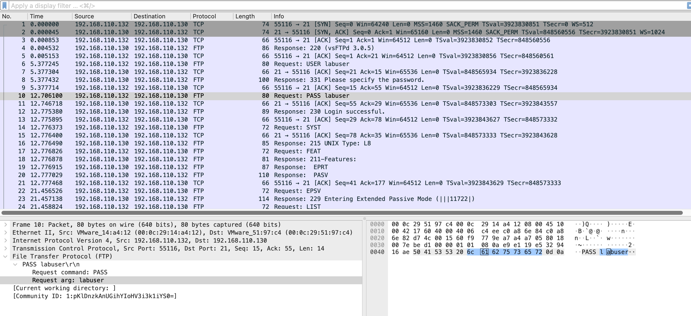

# FTP vs SSH: Same Action, Opposite Security

## Objective
Place FTP and SSH side by side to show how protocol choice determines whether a user's session is protected or exposed — using identical authentication actions captured on both protocols.

---

## Lab Setup
| Property | Value |
|----------|-------|
| Capture files | `ch2c-ftp-clean-login.pcapng` (FTP) · `ch3a-ssh-clean-login.pcapng` (SSH) |
| Source | Kali Linux — 192.168.110.132 |
| Target | Ubuntu 22.04 — 192.168.110.130 |

---

## Side-by-Side Comparison

### FTP — everything visible

```
Filter: ftp | Action: Follow TCP Stream
```

```
220 (vsFTPd 3.0.5)
USER labuser
331 Please specify the password.
PASS labuser
230 Login successful.
SYST → 215 UNIX Type: L8
PWD  → 257 "/home/labuser" is the current directory
QUIT → 221 Goodbye.
```

The entire session — banner, username, password, OS type, directory path — is readable plain text.

### SSH — nothing visible

```
Filter: tcp.port == 22 | Action: Follow TCP Stream
```

```
[binary noise]
[binary noise]
[binary noise — encrypted content]
```

The Follow TCP Stream window shows only encrypted binary data. No username, no password, no commands, no responses.

### Protocol comparison

| Property | FTP | SSH |
|----------|-----|-----|
| Encryption | None | chacha20-poly1305@openssh.com |
| Credential visibility | Plaintext in packet list | Not visible after handshake |
| Command visibility | Every command readable | Encrypted |
| Response visibility | Every response readable | Encrypted |
| Version exposed in banner | vsftpd 3.0.5 | OpenSSH 10.2p1 |
| Session reconstructible | Completely | Connection metadata only |

---

## Screenshots

**FTP stream: complete credentials and session in readable text**



**SSH stream: encrypted binary — no content visible**


---

## Key Finding

The same action — authenticating a user to a remote service — produces completely opposite network security outcomes depending on protocol choice. FTP exposes the full session to any observer on the network path. SSH provides complete confidentiality. Protocol selection is a security decision, not just a technical one.

---

## MITRE ATT&CK

| ID | Technique |
|----|-----------|
| T1040 | Network Sniffing |

---

## Defensive Recommendation

Disable vsftpd and configure the OpenSSH SFTP subsystem:

```bash
# /etc/ssh/sshd_config
Subsystem sftp /usr/lib/openssh/sftp-server
```

Encrypted file transfer using the SSH service already running — no additional software required.
