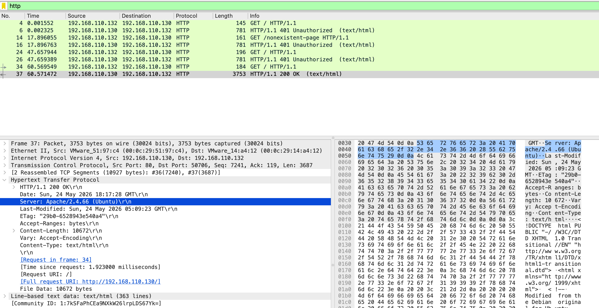
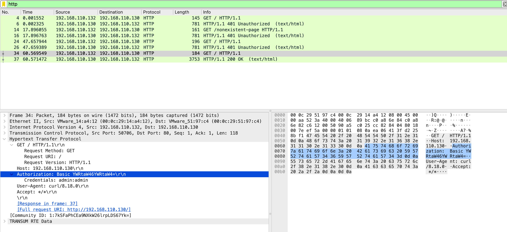

# HTTP Traffic Analysis

## Objective
Demonstrate how HTTP exposes all request and response content in plaintext, and how HTTP response codes give SOC analysts actionable intelligence about attacker behaviour.

---

## Lab Setup
| Property | Value |
|----------|-------|
| Source | Kali Linux — 192.168.110.132 |
| Target | Ubuntu 22.04 — 192.168.110.130 (Apache 2.4.66 with Basic Auth) |
| Capture interface | Ubuntu ens37 (defender perspective) |
| Capture file | `ch3b-http-traffic.pcapng` |

---

## Commands Used

```bash
curl http://192.168.110.130/                         # No credentials
curl http://192.168.110.130/nonexistent-page         # Non-existent path
curl -u admin:wrongpassword http://192.168.110.130/  # Wrong credentials
curl -u admin:admin http://192.168.110.130/          # Correct credentials
```

---

## Wireshark Filter

```
http
```

---

## Traffic Analysis

### Request 1 — No credentials → 401 Unauthorized

A basic HTTP GET with no Authorization header. Server returns 401 and a `WWW-Authenticate` header specifying the auth realm — revealing that the resource requires authentication and the mechanism used.

### Request 2 — Non-existent path → 401 (not 404)

A request to `/nonexistent-page` returns 401, not 404. Apache's Basic Auth is evaluated before path resolution — authentication is required before the server confirms whether a path exists. From a SOC perspective: 401 responses to varied paths from one source indicate path enumeration, not just failed login.

### Request 3 — Wrong credentials → 401 Unauthorized

Authorization header present but incorrect. Decoded: `admin:wrongpassword`. Every failed attempt is a visible data point confirming the brute force progression.

### Request 4 — Correct credentials → 200 OK

`admin:admin` returns 200 OK with full response headers:

```
Server: Apache/2.4.66 (Ubuntu)
Date: Sun, 24 May 2026 18:17:28 GMT
Content-Type: text/html
Content-Length: 10672
```

All response headers — server version, OS, date — in plaintext. The full HTML body follows.

### Response codes as SOC intelligence

| Code | Meaning | SOC signal |
|------|---------|-----------|
| 401 | Unauthorized | Failed auth — count and source-track |
| 404 | Not Found | Path probing / directory enumeration |
| 200 | OK | Successful access — verify expected |
| 405 | Method Not Allowed | Unusual HTTP method |

---

## Screenshots

**HTTP 200 OK with Apache server header expanded — Server: Apache/2.4.66 (Ubuntu) highlighted**



**HTTP GET with Authorization decoded to admin:admin**



---

## Key Findings

- `Server: Apache/2.4.66 (Ubuntu)` in every response — cannot be hidden without configuration change
- Every 401 confirms which credentials were rejected — brute force progression documented
- Non-existent path returns 401, not 404 — server reveals auth requirement before path existence
- Credentials decoded automatically by Wireshark — `Credentials: admin:admin` shown in packet details
- Full response body in plaintext — all served content visible to any network observer

---

## MITRE ATT&CK

| ID | Technique |
|----|-----------|
| T1071.001 | Application Layer Protocol: Web Protocols |
| T1040 | Network Sniffing |

---

## Defensive Recommendations

- Deploy HTTPS — TLS encrypts all HTTP content including headers, credentials, and response body
- Suppress server tokens: `ServerTokens Prod` in Apache (shows `Apache` not the version)
- Alert on 401 patterns: multiple 401s from one IP within a short window triggers brute force detection
- Replace Basic Auth with session-based or token-based authentication
