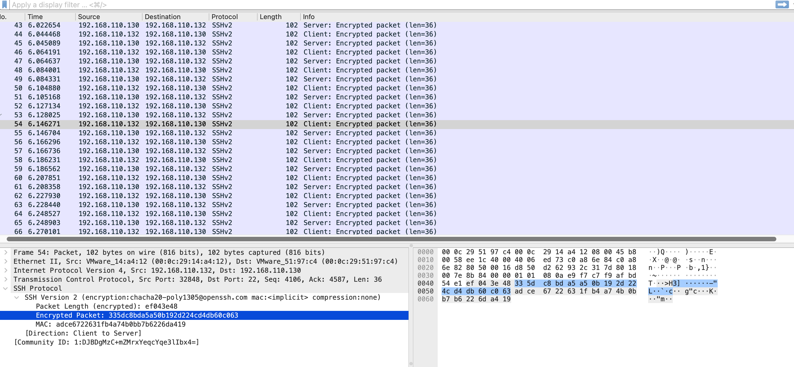

# Plaintext vs Encrypted Protocol Analysis

## Overview

This analysis places FTP and SSH side by side to demonstrate how protocol selection determines whether a user session is protected or exposed. Both protocols were used to authenticate the same account to the same host. The resulting captures illustrate a fundamental principle in network security: the same login activity looks completely different depending on the protocol. In FTP and HTTP, credentials were visible directly in packet captures. In SSH, the connection behavior was visible, but the payload was encrypted.

**Capture files:**
- FTP: [`ftp-session-credential-exposure.pcapng`](../pcap-files/authentication-attacks/ftp-session-credential-exposure.pcapng)
- SSH: [`ssh-encrypted-session.pcapng`](../pcap-files/protocol-analysis/ssh-encrypted-session.pcapng)

---

## Environment

| Property | Value |
|----------|-------|
| Source | 192.168.110.132 (Kali Linux) |
| Target | 192.168.110.130 (Ubuntu — vsftpd 3.0.5 / OpenSSH 10.2p1) |
| Interface captured | Ubuntu ens37 (defender perspective) |

---

## Commands Used

```bash
# FTP session — plaintext protocol
ftp 192.168.110.130
# Username: labuser / Password: labuser

# SSH session — encrypted protocol
ssh labuser@192.168.110.130
# Commands run: whoami, ls, exit
```

---

## Wireshark Filters

```
# FTP session — plaintext
ftp

# SSH session — encrypted
tcp.port == 22
```

Apply Follow → TCP Stream on any packet from either session for the clearest comparison.

---

## Analysis

### FTP — Full Session Exposed

Applying the `ftp` filter and selecting Follow TCP Stream on the FTP capture produces the entire session as readable text:

```
220 (vsFTPd 3.0.5)
USER labuser
331 Please specify the password.
PASS labuser
230 Login successful.
SYST → 215 UNIX Type: L8
FEAT → 211-Features: EPRT, PASV
PWD  → 257 "/home/labuser" is the current directory
LIST → [directory contents transferred]
QUIT → 221 Goodbye.
```

Every element of the session — software version, username, password, OS type, home directory path, directory listing, and all post-login commands — is transmitted as plaintext. A passive observer on any network segment between the client and server recovers this in full without any decryption capability.

### SSH — Session Content Not Recoverable

Applying the `tcp.port == 22` filter and selecting Follow TCP Stream on the SSH capture produces:

```
[binary noise — encrypted content]
[binary noise — encrypted content]
[binary noise — encrypted content]
```

The stream window displays only ciphertext. Protocol metadata — connection timing, packet sizes, source and destination IPs — is observable, but the username, password, commands issued, and all server responses are cryptographically protected.

The encryption in use across this session:

```
SSH Version 2 (encryption: chacha20-poly1305@openssh.com mac:<implicit>)
Encrypted Packet: [hex — no readable content]
MAC: [message authentication code]
```

### Comparison

| Property | FTP | SSH |
|----------|-----|-----|
| Encryption | None | chacha20-poly1305@openssh.com |
| Username visible | Yes — `USER labuser` in packet list | No |
| Password visible | Yes — `PASS labuser` in packet list | No |
| Commands visible | Yes — every command readable | No |
| Server responses visible | Yes — every response readable | No |
| OS type disclosed | Yes — `215 UNIX Type: L8` | No |
| Home directory disclosed | Yes — `257 "/home/labuser"` | No |
| Software version disclosed | Yes — `220 (vsFTPd 3.0.5)` | Protocol banner only |
| Session reconstructible | Completely | Connection metadata only |

---

## Evidence

**Figure 1 — FTP Follow TCP Stream: complete session in readable plaintext**

*USER labuser, PASS labuser, 230 Login successful, SYST, PWD, and full directory path — all visible without decryption.*


**Figure 2 — SSH Follow TCP Stream: encrypted binary — no session content recoverable**

*Same action (authenticated remote session), zero credential or command visibility.*



---

## Key Findings

- **Same action, opposite outcomes** — authenticating to a remote service over FTP exposes the full session; over SSH it is fully protected
- **FTP discloses beyond credentials** — OS type, home directory, supported features, and all post-login commands are exposed in addition to the username and password
- **SSH encryption is effective** — chacha20-poly1305 provides confidentiality, integrity, and authenticity; no session content is recoverable from the capture
- **Protocol selection is a security decision** — FTP and SSH both provide remote access and file transfer; the security difference between them is total

---

## MITRE ATT&CK

| ID | Technique | Tactic |
|----|-----------|--------|
| T1040 | Network Sniffing | Credential Access |

---

## Recommendation

Replace vsftpd with the OpenSSH SFTP subsystem — identical file transfer functionality with complete session encryption, using the SSH service already running on port 22:

```bash
# Add to /etc/ssh/sshd_config
Subsystem sftp /usr/lib/openssh/sftp-server
```

No additional software, no additional service, no additional attack surface.
