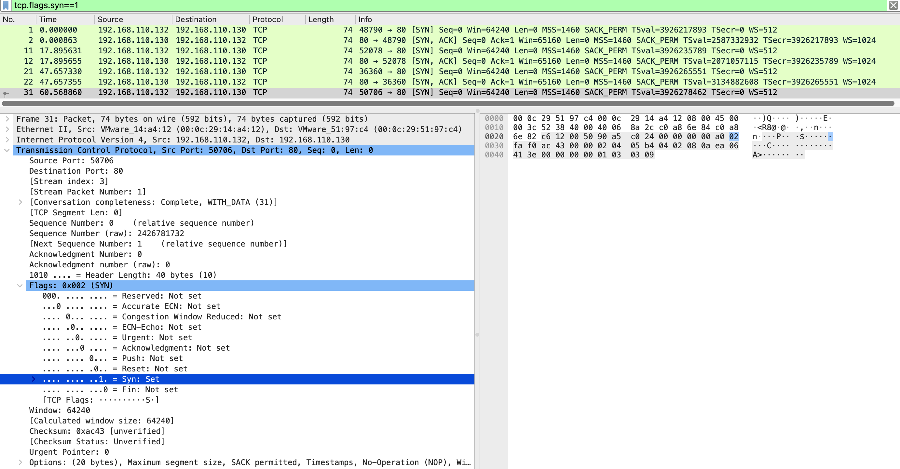
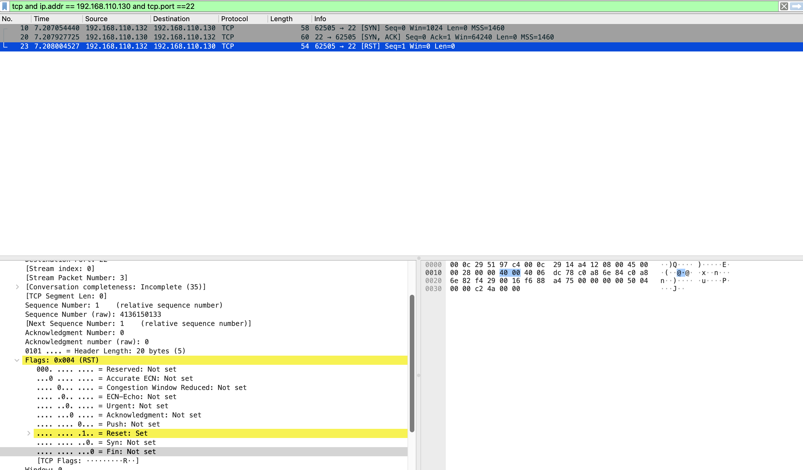

# TCP Handshake Analysis

## Objective
Contrast the normal TCP three-way handshake with the abnormal half-open handshake produced by a SYN scan — showing how TCP flag analysis identifies port scanning at the packet level.

---

## Lab Setup
| Property | Value |
|----------|-------|
| Normal handshake capture | `ch3b-http-traffic.pcapng` (HTTP curl connections) |
| Abnormal handshake capture | `nmap-syn-scan.pcapng` (reused from Network Reconnaissance) |

---

## Wireshark Filters

**Normal handshake:**
```
tcp.flags.syn == 1
```

**Abnormal handshake — SYN scan on open port:**
```
tcp and ip.addr == 192.168.110.130 and tcp.port == 22
```

---

## Traffic Analysis

### Normal TCP three-way handshake

From the HTTP traffic capture — every `curl` connection:

```
Kali → Ubuntu:80   [SYN]      Seq=0 Win=64240  ← connection request
Ubuntu → Kali      [SYN, ACK] Seq=0 Ack=1      ← accepted
Kali → Ubuntu:80   [ACK]      Seq=1 Ack=1      ← handshake complete
[HTTP data exchange]
Kali → Ubuntu:80   [FIN, ACK]                  ← graceful close
Ubuntu → Kali      [FIN, ACK]                  ← acknowledged
```

Key TCP fields in a normal SYN packet:
```
Flags: 0x002 (SYN)
  SYN: Set
  ACK: Not set
Window: 64240          ← real OS TCP window size
Conversation completeness: Complete, WITH_DATA
```

### Abnormal TCP handshake — SYN scan

From the SYN scan capture, port 22 (open):

```
Kali → Ubuntu:22   [SYN]      Seq=0 Win=1024   ← Nmap probe
Ubuntu → Kali      [SYN, ACK] Seq=0 Ack=1      ← port is open
Kali → Ubuntu:22   [RST]      Seq=1 Win=0      ← deliberately aborted
```

Key TCP fields in the RST packet:
```
Flags: 0x004 (RST)
  Reset: Set
  SYN: Not set
  ACK: Not set
Window: 0
Conversation completeness: Incomplete (35)
```

Wireshark flags the conversation as `Incomplete` automatically.

### Diagnostic comparison

| Property | Normal Connection | SYN Scan |
|----------|-----------------|----------|
| SYN Window size | 64240 (real OS) | 1024 (Nmap crafted) |
| Third packet | ACK — handshake completes | RST — deliberately aborted |
| ACK flag on RST | No | No |
| Conversation status | Complete, WITH_DATA | Incomplete (35) |
| Data exchange | Yes | Never |

---

## Screenshots

**Normal TCP handshake: SYN flags expanded, Window=64240 (real OS value)**



**Abnormal handshake: RST flags expanded — Reset=Set, Window=0, Incomplete conversation**



---

## Key Findings

- `Win=1024` is Nmap's fingerprint — real OS connections use `Win=64240` or larger
- RST without ACK only occurs when a connection is deliberately aborted, not gracefully closed
- `Conversation completeness: Incomplete (35)` — Wireshark's automatic confirmation of an abnormal exchange
- No data exchange in a SYN scan — SYN/SYN-ACK/RST with zero bytes of application data

---

## MITRE ATT&CK

| ID | Technique |
|----|-----------|
| T1046 | Network Service Scanning |

---

## Defensive Recommendations

IDS detection rules for SYN scan:
- Alert on TCP SYN packets with `window_size_value == 1024` from external sources
- Alert on TCP SYN followed immediately by RST from the same source (half-open pattern)
- Alert on >50 incomplete TCP conversations from one source within 10 seconds
